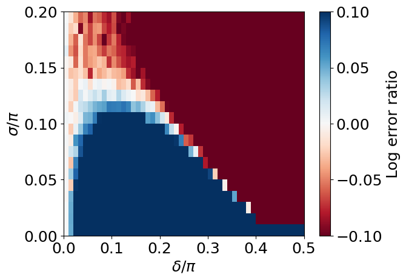

# noisy-qsp-rdg

### Code Structure

* `qsp.py` is the main module with the QSP simulation and optimization methods
* `plots.py` contains assorted data handling and plot generation methods
* `classical.py` calculates the single-shot Helstrom probabilities
* `sample-angles.py` generates a set of optimal QSP-3 angles for a 0.001 by 0.001 grid, calculates the probabilities, and saves the results
* `sample-plots.py` loads all the data and produces quantum advantage plots

### Usage

The workflow for any QSP strategy is to first generate optimal angles and calculate probabilities (e.g. `sample-angles.py`), then plot the results (e.g. `sample-plots.py`). Because optimization is slow due to many iterations of calling `qsp_simul`, it is typical to do the optimization using a smaller number of trials, and then calculate the probabilities more precisely using a larger number of trials with set angles. One can also run the same optimization many times with different randomization or initial conditions, and then take the supremum of the results.

For the sample code, the order of files to run is
* `python classical.py` - This will calculate a 2D-array of success probabilities and save it in `data/classical-exact.txt`.
* `python sample-angles.py` (can optionally be swapped with the prior step) - This will store the optimal angles data in `data/qsp-3-angles.npy`, which can loaded for the future. It also saves a 2D-array of success probabilities in `data/qsp-3-data.txt`
* `python sample-plots.py` - This displays and saves several plots, such as those shown below.

One may wish to modify the loops to a coarser or smaller grid on a first go. The procedure is embarrassingly parallel, as the optimization and calculations can be performed on different regions of the grid in parallel.

### Examples

Applying the sample code to one run on a 0.01 by 0.01 grid up to y=0.20 will run serially in the order of 24 hours and produce plots like these:

The angles used are in `data/small-qsp-3-angles.npy`. Note that these plots show the same data, just represented differently in terms of success or error. Since the parameter space is large, there are many local minima, so a single round of optimization may not achieve the global minimum error. A complete set of angles and probabilities obtained after four rounds of optimizations is provided in `data/full-qsp3.csv`.
